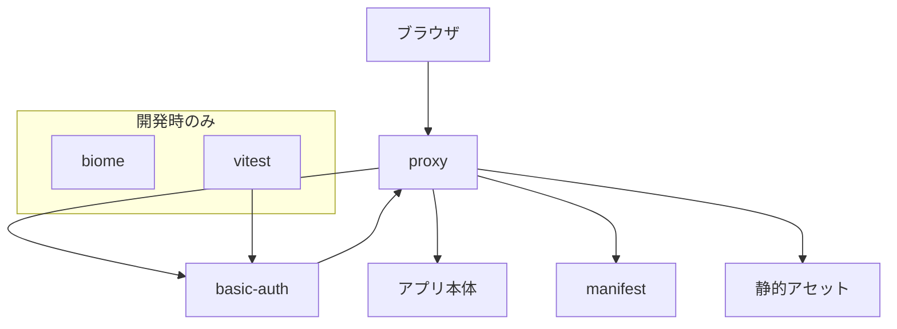
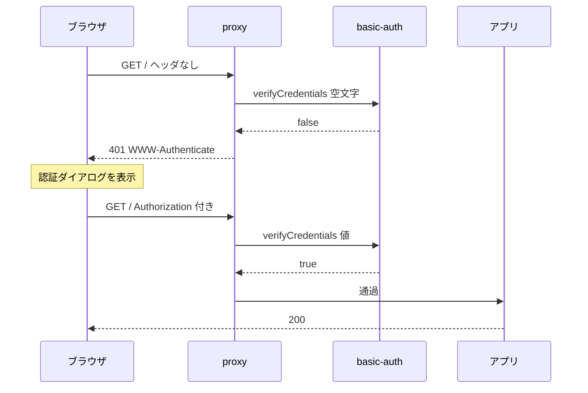

# Design Document

## Overview

**Purpose**: 機能を持たないアプリに、開発を継続するための土台を与える。静的解析、自動テスト、アクセス制御、ホーム画面への追加の 4 領域を揃え、記録機能（`meal-record`）の実装に着手できる状態にする。

**Users**: 利用者本人ひとり。開発者と利用者が同一人物である。

**Impact**: `create-next-app` 直後の状態を変更する。ルート直下に設定ファイル 3 つ（`biome.json` / `vitest.config.mts` / `vitest.setup.ts`）が加わり、`src/` に認証と manifest の 3 ファイルが加わる。既存の 2 コンポーネントは整形の対象になる。

### Goals

- 静的解析と整形を単一のコマンドで実行でき、違反があれば非ゼロで終了する
- 自動テストが実行でき、TDD で実装タスクを進められる
- 認証情報を持たない要求をアプリ全体で遮断する
- ホーム画面に追加でき、そこから全画面で起動する

### Non-Goals

- 食事の記録機能、vault への書き込み、プリセットの提供
- オフライン動作、バックグラウンド同期、プッシュ通知
- 公開環境への配置作業
- アイコンの意匠

## Boundary Commitments

### This Spec Owns

- 静的解析と整形の設定、およびそれを起動するコマンド
- テスト実行環境の設定、およびそれを起動するコマンド
- アプリ全体に対するアクセス制御の判定と遮断
- ホーム画面への追加に必要なメタデータの提供

### Out of Boundary

- **画面の中身**。本 spec はページを 1 枚も追加しない。既存のテンプレートページはそのまま残す
- **記録機能に関わる一切**。GitHub Contents API の呼び出し、frontmatter の生成、プリセットの保持
- **アイコンの意匠**。暫定の画像で成立させ、差し替えは別タスクが行う
- **配置作業**。公開環境への接続と初回デプロイ

### Allowed Dependencies

- Next.js 16 / React 19 / TypeScript 5 / Tailwind CSS v4 — 既存の構成
- Node.js 標準モジュール（`node:crypto`、`node:buffer`）— `proxy` が nodejs ランタイムであるため利用可能
- 新規に追加する開発依存のみ。実行時依存は追加しない

### Revalidation Triggers

- **アクセス制御の適用範囲を変更したとき** — 除外パスを設けると、そこは無認証で到達可能になる
- **`proxy` のランタイムが変わったとき** — `node:crypto` が使えなくなり、認証の実装方式が変わる
- **manifest の配信経路を変更したとき** — 認証との関係が変わり、ホーム画面への追加可否に影響する
- **環境変数の名称を変更したとき** — 配置環境の設定と齟齬が生じ、認証が有効にならない
- **公開環境の判定方法を変更したとき** — 判定が誤ると、設定漏れの検知が働かず無防備なまま公開されうる

## Architecture

### Architecture Pattern & Boundary Map



**Architecture Integration**:

- **選択したパターン**: 単一の関門（`proxy`）で全経路を遮断し、判定ロジックは純粋関数に分離する。層と呼べるほどの構造は持たない
- **境界の分け方**: 「HTTP を知っている層（`proxy`）」と「知らない層（`basic-auth`）」を分ける。後者は `Request` にも `Response` にも依存せず、文字列を受けて真偽値を返す
- **既存パターンの維持**: App Router のファイル規約、`@/` エイリアス、サーバーコンポーネント既定という steering の方針を変更しない
- **新規要素の根拠**: `basic-auth` を独立させるのは、テストを HTTP の組み立てなしに書けるようにするため。テスト基盤の動作確認をこの単体テストが兼ねる

**依存の方向**: `basic-auth` → `proxy` の一方向のみ。`basic-auth` は Next.js の型を一切参照しない。逆向きの import は誤りとして扱う。

### Technology Stack

| Layer | Choice / Version | Role in Feature | Notes |
|-------|------------------|-----------------|-------|
| 静的解析・整形 | Biome（最新安定版） | 検査と自動整形 | `next lint` は Next.js 16 で削除済み。公式が Biome を名指しで案内 |
| テスト | Vitest + jsdom + Testing Library | テストの実行 | React コンポーネントのテストに備えて jsdom を含める |
| アクセス制御 | Next.js `proxy` 規約 | 全経路の遮断 | Next.js 16 で `middleware` から改名。ランタイムは nodejs 固定 |
| 認証の比較 | `node:crypto` の `timingSafeEqual` | 定数時間比較 | nodejs ランタイムのため利用可能 |
| PWA | `app/manifest.ts`（`MetadataRoute.Manifest`） | 追加情報の提供 | **Service Worker は導入しない** |

新規の実行時依存はゼロ。追加はすべて `devDependencies` に入る。

## File Structure Plan

### Directory Structure

```
biome.json                      検査と整形の設定
vitest.config.mts               テスト環境の設定
vitest.setup.ts                 Testing Library のマッチャ登録
.env.local.example              必要な環境変数の名称と説明

src/
├── proxy.ts                    全要求の遮断点。Next.js の規約ファイル
├── lib/
│   ├── basic-auth.ts           認証ヘッダの検証。HTTP に依存しない純粋関数
│   └── basic-auth.test.ts      上の単体テスト
└── app/
    └── manifest.ts             ホーム画面への追加情報
```

アイコンのファイルは追加しない。既存の `src/app/favicon.ico` を manifest から参照する。

`proxy.ts` は `src/` 配下に置く。Next.js は `src/` が存在する場合そこを規約ファイルの探索先とする。

### Modified Files

- `package.json` — `scripts` に検査・整形・テストの 3 系統を追加。`devDependencies` に Biome と Vitest 一式を追加
- `src/app/layout.tsx` — `metadata` のタイトルと説明を `Create Next App` から実際の名称に変更。整形の対象にもなる
- `src/app/page.tsx` — 整形の対象。内容は変更しない
- `.gitignore` — `.env.local` は既に `.env*` で除外済みのため変更不要

## System Flows



**Key Decisions**:

- 判定は `proxy` に入った全要求に対して行う。除外パスを設けない
- 失敗時は 401 と `WWW-Authenticate: Basic realm="..."` を返す。リダイレクトはしない。ブラウザに認証ダイアログを出させるため
- manifest とアイコンも遮断の対象に含む。ブラウザは manifest 取得時に認証情報を送らないが、Next.js が `<link>` に `crossorigin="use-credentials"` を付与するため送られる想定（検証項目）

## Requirements Traceability

| Requirement | Summary | Components | Interfaces | Flows |
|-------------|---------|------------|------------|-------|
| 1.1, 1.2, 1.3 | 検査の実行と違反の報告 | 検査・整形設定 | `pnpm check` | — |
| 1.4 | 自動修正 | 検査・整形設定 | `pnpm format` | — |
| 1.5 | 既存ファイルも対象 | 検査・整形設定 | `biome.json` の対象範囲 | — |
| 2.1, 2.2, 2.3 | テストの実行と失敗の報告 | テスト設定 | `pnpm test` | — |
| 2.4 | 監視モード | テスト設定 | `pnpm test:watch` | — |
| 2.5 | 0 件でも異常終了しない | テスト設定 | `--passWithNoTests` | — |
| 3.1, 3.2, 3.3 | 認証の要求と通過 | 遮断点 / 認証判定 | `proxy` / `verifyCredentials` | 認証フロー |
| 3.4 | 認証が有効なとき全経路が対象 | 遮断点 | `config.matcher` | 認証フロー |
| 3.5 | 認証情報を含めない | 遮断点 | 環境変数 | — |
| 3.6 | 手元で未設定なら素通り | 遮断点 | `loadCredentials` が `null` | 認証フロー |
| 3.7 | 公開環境で未設定なら通さない | 遮断点 | 500 応答 | 認証フロー |
| 4.1, 4.2, 4.3 | 追加情報の提供と全画面起動 | アプリマニフェスト | `MetadataRoute.Manifest` | — |

## Components and Interfaces

| Component | Domain/Layer | Intent | Req Coverage | Key Dependencies | Contracts |
|-----------|--------------|--------|--------------|------------------|-----------|
| 認証判定 | ドメイン | 認証ヘッダの検証 | 3.1, 3.2, 3.3 | なし | Service |
| 遮断点 | ランタイム | 全要求の関門 | 3.1〜3.5 | 認証判定 (P0) | Service |
| アプリマニフェスト | メタデータ | 追加情報の提供 | 4.1, 4.2, 4.3 | なし | Service |
| 検査・整形設定 | 開発ツール | 品質チェック | 1.1〜1.5 | なし | — |
| テスト設定 | 開発ツール | テスト実行 | 2.1〜2.5 | なし | — |

### ドメイン層

#### 認証判定

| Field | Detail |
|-------|--------|
| Intent | `Authorization` ヘッダの値が、設定された認証情報と一致するかを判定する |
| Requirements | 3.1, 3.2, 3.3 |

**Responsibilities & Constraints**

- ヘッダ値の解析と比較のみを担う。HTTP の応答は組み立てない
- Next.js の型（`NextRequest` など）を参照しない。文字列を受けて真偽値を返す
- 比較は定数時間で行う。値の長さの差から情報が漏れないよう、比較前に固定長へ変換する

**Dependencies**

- Inbound: 遮断点 — 判定の依頼（P0）
- External: `node:crypto` — 定数時間比較（P0）

**Contracts**: Service [x]

##### Service Interface

```typescript
/** 期待する認証情報。実行環境から読み出した値をそのまま保持する。 */
export type Credentials = {
  readonly user: string;
  readonly password: string;
};

/** 環境変数から認証情報を読み出す。両方が揃っていなければ null。 */
export function loadCredentials(
  env: Record<string, string | undefined>,
): Credentials | null;

/**
 * Authorization ヘッダの値を検証する。
 * @param header `Basic <base64>` 形式の文字列。ヘッダが無い場合は null を渡す
 */
export function verifyCredentials(
  header: string | null,
  expected: Credentials,
): boolean;
```

- **Preconditions**: `expected` は `loadCredentials` が `null` 以外を返した値であること
- **Postconditions**: `header` が `Basic ` で始まらない、復号できない、`user:password` の形をしていない、値が一致しない場合はいずれも `false` を返す。`loadCredentials` は 2 つの変数が揃っている場合のみ値を返し、片方でも欠ければ `null` を返す
- **Invariants**: **どちらの関数も例外を投げない。** 判定に要する時間は入力の内容に依存しない

**Implementation Notes**

- Integration: 認証情報は要求ごとに読み出す。認証の有効・無効が設定の有無で決まるため、起動時に固定すると設定を変えた際に再起動が要る
- **引数の型**: `NodeJS.ProcessEnv` ではなく `Record<string, string | undefined>` を受ける。`process.env` はこの型に代入できるため呼び出し側は変わらない。フレームワークが `NodeJS.ProcessEnv` を拡張して特定のキーを必須にしている場合、テストから部分的なオブジェクトを渡せなくなるため。HTTP の型に依存しないという方針と同じ理由で、実行環境固有の型にも依存させない
- Validation: 片方だけ設定されている状態は「未設定」として扱う。中途半端な設定で認証が有効になることを避ける
- Risks: base64 の復号に失敗する入力（不正なバイト列）を受け取りうる。例外にせず `false` を返す

### ランタイム層

#### 遮断点

| Field | Detail |
|-------|--------|
| Intent | すべての要求を受け、認証を通らないものをアプリに到達させない |
| Requirements | 3.1, 3.2, 3.3, 3.4, 3.5 |

**Responsibilities & Constraints**

- Next.js の `proxy` 規約に従う。ファイル名は `proxy.ts`、エクスポートする関数名は `proxy`
- 判定そのものは行わず、認証判定に委譲する
- 除外パスを設けない。静的アセットと manifest も対象に含む

**Dependencies**

- Inbound: ブラウザからの全要求（P0）
- Outbound: 認証判定 — 検証の依頼（P0）

**Contracts**: Service [x]

##### Service Interface

```typescript
import type { NextRequest } from "next/server";

/** Next.js 16 の proxy 規約。ランタイムは nodejs 固定。 */
export function proxy(request: NextRequest): Response | undefined;

/** 適用範囲。除外を設けず全経路を対象にする。 */
export const config: { matcher: readonly string[] };
```

- **Preconditions**: なし。認証情報の有無に応じて挙動を変える
- **Postconditions**: 次の 4 通りに分岐する。

  | 認証情報 | 環境 | 応答 |
  |---|---|---|
  | 未設定 | 手元 | `undefined` を返して素通りさせる |
  | 未設定 | 公開 | **500 を返す**。設定の不足を示し、要求を通さない |
  | 設定あり | 問わず | 検証する。通れば `undefined`、通らなければ 401 と `WWW-Authenticate` |

- **Invariants**: 公開する環境において、認証情報が設定されていない状態で要求がアプリに到達しない

**Implementation Notes**

- Integration: `matcher` は全経路を対象にする。`_next/static` を除外しない。利用者が 1 名であり、性能上の懸念がないため
- **環境の判定**: `NODE_ENV` が `production` である場合を公開する環境とみなす。この判定は**認証情報が無いときの振る舞いを決めるためだけ**に使う。認証の有効・無効そのものは認証情報の有無で決まるため、手元でも設定すれば認証を試せる
- Validation: 判定は要求時に行う。ビルド時に環境変数を要求しないため、変数の無い環境でもビルドは通る
- Risks: 除外を設けないため、静的アセットの取得も認証を通る必要がある。同一オリジンであればブラウザが認証情報を送るため通る見込みだが、**manifest だけはブラウザが独自の経路で取得する**ため保証がない
- **実装の最初に確認する**: (1) 認証後にページの CSS と JavaScript が読み込まれる (2) 生成 HTML の `<link rel="manifest">` に `crossorigin="use-credentials"` が付与されている (3) 開発者ツールで manifest が 200 で取得できる
- **退避策**: (3) が 401 になる場合、`matcher` から manifest とアイコンのパスのみを除外する。いずれも中身のないメタデータであり、公開されても実害はない。ただし除外の追加は Revalidation Triggers に該当するため、実施時は本節と Security Considerations を更新する

### メタデータ層

#### アプリマニフェスト

| Field | Detail |
|-------|--------|
| Intent | ホーム画面への追加に必要な情報を提供する |
| Requirements | 4.1, 4.2, 4.3 |

**Contracts**: Service [x]

```typescript
import type { MetadataRoute } from "next";

export default function manifest(): MetadataRoute.Manifest;
```

必須の項目は `name`、`short_name`、`start_url`、`display`（`standalone`）、`background_color`、`theme_color`、およびアイコン 1 点。`display: "standalone"` が Requirement 4.2 のアドレスバー非表示を担う。

**Implementation Notes**

- Integration: `src/app/manifest.ts` に置く。Next.js が `<link rel="manifest">` を自動で出力する
- **アイコン**: 既存の `src/app/favicon.ico` を `sizes: "any"` で参照する（Next.js 公式のサンプルと同じ形）。本 spec ではアイコンのファイルを新規に追加しない。意匠を持つアイコンは配置前に別タスクで用意し、その時点で本ファイルの `icons` を差し替える
- Validation: 生成された HTML に `crossorigin="use-credentials"` が含まれることを確認する。含まれない場合は `layout.tsx` で手動の `<link>` を出力する
- Risks: `favicon.ico` はホーム画面のアイコンとしては粗い。配置前の差し替えを前提とする

### 開発ツール

検査・整形設定とテスト設定は新たな境界を導入しないため、詳細ブロックを設けない。

- **検査・整形設定**: `biome.json` 1 ファイル。`.gitignore` を尊重して `node_modules` と `.next` を除外し、加えて `public`（外部提供のアセット。ロゴ画像が a11y ルールに抵触し、自動整形では解消しない）と `.kiro`（cc-sdd が管理する仕様書とテンプレート。整形すると更新時に競合する）も対象外とする。`package.json` に `check`（検査のみ）と `format`（自動修正）を追加する
- **コミット前の自動検査**: git の `pre-commit` から、**コミットに含めようとしているファイルのみ**を検査する。検査ツール自身が対象を絞る機能（`--staged`）を持つため、ステージ済みファイルを抽出する別のツールは要さない。hook は**リポジトリに含める**形で管理し、依存の導入時に自動で有効化する。`.git/hooks/` に直接置く方式は採らない。`.git/` は複製されず、別の環境でクローンしたときに効かないため
- **テスト設定**: `vitest.config.mts` で `environment: "jsdom"`、`globals: true`、`setupFiles`、`@/` エイリアスの解決を設定する。`vitest.setup.ts` で Testing Library のマッチャを登録する。拡張子を `.mts` にするのは、`package.json` に `"type": "module"` が無いと `.ts` が CommonJS として読まれ、`import.meta.url` が警告の対象になるため

## Error Handling

### Error Strategy

設定漏れの扱いは環境で分ける。手元では素通りさせ、公開する環境では要求を通さない。実行時のエラーは利用者に見える形で返す。認証に関わる失敗は理由を明かさない。

### Error Categories and Responses

**設定エラー（要求時）**: 環境変数が未設定 → 手元では素通りさせ、公開する環境では 500 を返す。応答に不足している変数名を含める。値は含めない。判定は要求ごとに行い、モジュール読み込み時には例外を投げない

**認証エラー（401）**: ヘッダなし / 形式不正 / 値の不一致 → いずれも同一の 401 応答を返す。「ユーザ名が違う」「パスワードが違う」を区別しない。区別すると総当たりの手掛かりになる

**入力エラー**: base64 の復号に失敗する不正なバイト列 → 例外を投げず `false` として扱い、401 に集約する

### Monitoring

本 spec では監視の仕組みを導入しない。利用者が 1 名であり、配置環境の標準ログで足りる。

## Testing Strategy

### Unit Tests

認証判定を対象とする。テスト基盤の動作確認を兼ねるため、本 spec で唯一のテスト対象となる。

1. `verifyCredentials` に正しい `Basic` ヘッダを渡すと `true` を返す（3.2）
2. `verifyCredentials` に `null` を渡すと `false` を返す（3.1）
3. `verifyCredentials` に誤ったパスワードを渡すと `false` を返す（3.3）
4. `verifyCredentials` に `Basic ` で始まらない値、および復号できない値を渡すと、例外を投げずに `false` を返す（3.3）
5. `loadCredentials` は 2 つの変数が揃っているとき、その値を持つ認証情報を返す（3.1, 3.2）
6. `loadCredentials` は両方が欠けているとき、および片方のみ設定されているとき、いずれも `null` を返す（3.6）

### 遮断点の自動テストは行わない

`proxy` 関数を直接呼ぶテストは `next/experimental/testing/server` に依存する。
`unstable_` 接頭辞が示すとおり実験的な API であり、Next.js の更新で壊れうる。
`matcher` を頻繁に変更する性質のプロジェクトではないため、自動化の利益が依存の risk を上回らない。

判定ロジックと遮断の配線を分けて考え、**前者は単体テストで、後者は手作業の確認で**担保する。

### 手作業での確認

実装完了時に、以下をブラウザで確認する。

7. 認証情報を設定しない状態でアプリを開くと、認証を求められずページが表示される（3.6）
8. 認証情報を設定して起動し直すと、認証ダイアログが表示される（3.1）
9. 誤った認証情報を入力すると、再度ダイアログが表示される（3.3）
10. 正しい認証情報を入力すると、ページが表示される（3.2）
11. 認証を通過したあと、ページの CSS と JavaScript が読み込まれる（3.4）
12. 生成された HTML の `<link rel="manifest">` に `crossorigin="use-credentials"` が付与されている（4.1）
13. 開発者ツールで manifest が 200 で取得でき、インストール可能と判定される（4.1, 4.3）
14. `NODE_ENV` を production にし、認証情報を設定せずに起動すると 500 が返る（3.7）
15. 違反のあるコードに対し検査コマンドが非ゼロで終了する（1.3）
16. 失敗するテストに対しテストコマンドが非ゼロで終了する（2.3）

項目 7〜10 が遮断の配線と、設定の有無による切り替えを担保する。項目 11 と 13 は、
`matcher` に除外を設けない判断が成立するかを確かめるためのもので、失敗した場合は
遮断点の Implementation Notes に記した退避策を適用する。項目 14 は設定漏れのまま
公開される事故を防げているかの確認で、`NODE_ENV` を変えて起動するだけで確かめられる。

ホーム画面への追加と全画面起動の実機確認は、requirements の Boundary Context に従い利用者が別途行う。

## Security Considerations

- **認証情報の保管**: `.env.local` に置く。`.gitignore` の `.env*` により追跡されない。`.env.local.example` には変数名と用途のみを記し、値は含めない
- **比較方法**: `timingSafeEqual` により定数時間で比較する。長さが異なる入力でも比較時間が変わらないよう、比較前に固定長へ変換する
- **失敗応答の均質化**: 認証失敗の理由を応答から区別できないようにする
- **適用漏れの防止**: `matcher` に除外を設けない。除外を追加する変更は Revalidation Triggers に該当し、影響の再確認を要する
- **設定漏れの防止**: 手元では認証情報が無くても素通りさせるが、**公開する環境では要求を通さず 500 を返す**。開発の快適さと引き換えに無防備な公開が起きないようにする。認証の有効・無効を `NODE_ENV` で直接分岐させず、認証情報の有無で決めるのは、手元でも認証の挙動を確かめられるようにするため
- **後続 spec への申し送り**: 遮断点は**多層防御の 1 層目であり、唯一の防壁ではない**。Server Function は独立したルートではなく、それが使われているルートへの POST として扱われる。したがって `matcher` の変更や、Server Function を別ルートへ移すリファクタによって、**保護が静かに外れうる**。`meal-record` が Server Function で GitHub にコミットする設計を取る場合、その関数の内部でも認証を検証すること。遮断点だけに依存しない
